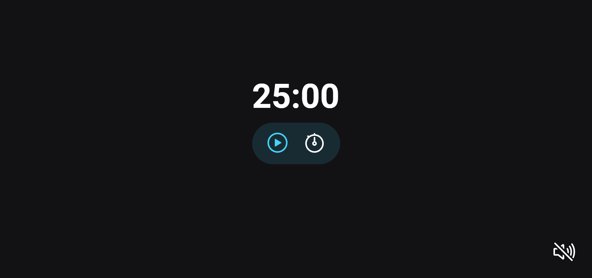

# Projeto - Focus Timer

### Acesse o projeto: [Aqui](https://jonasncsantos.github.io/Focus-Timer/)
## Sobre
Projeto desenvolvido durante aula para aplicação dos conhecimentos ensinados no curso Explorer da [Rocketseat](https://www.rocketseat.com.br/") no Stage 05.

## Aprendizados
- Manipulação da DOM
  - Audio
- Eventos
- Função
  - Recursiva
  - Factory
- Modulos
- Objetos